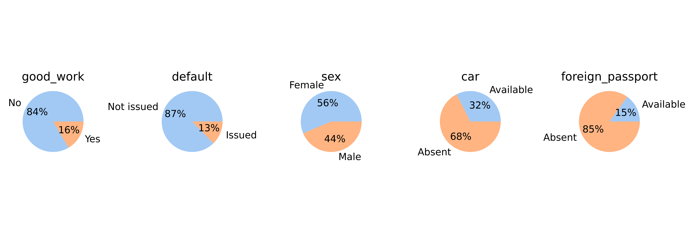
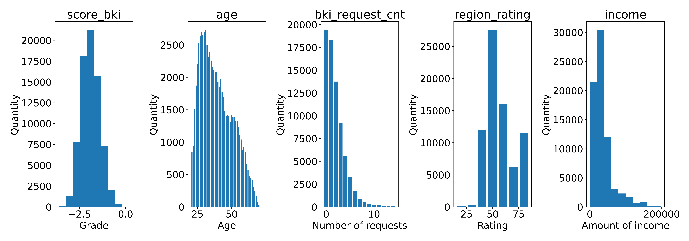
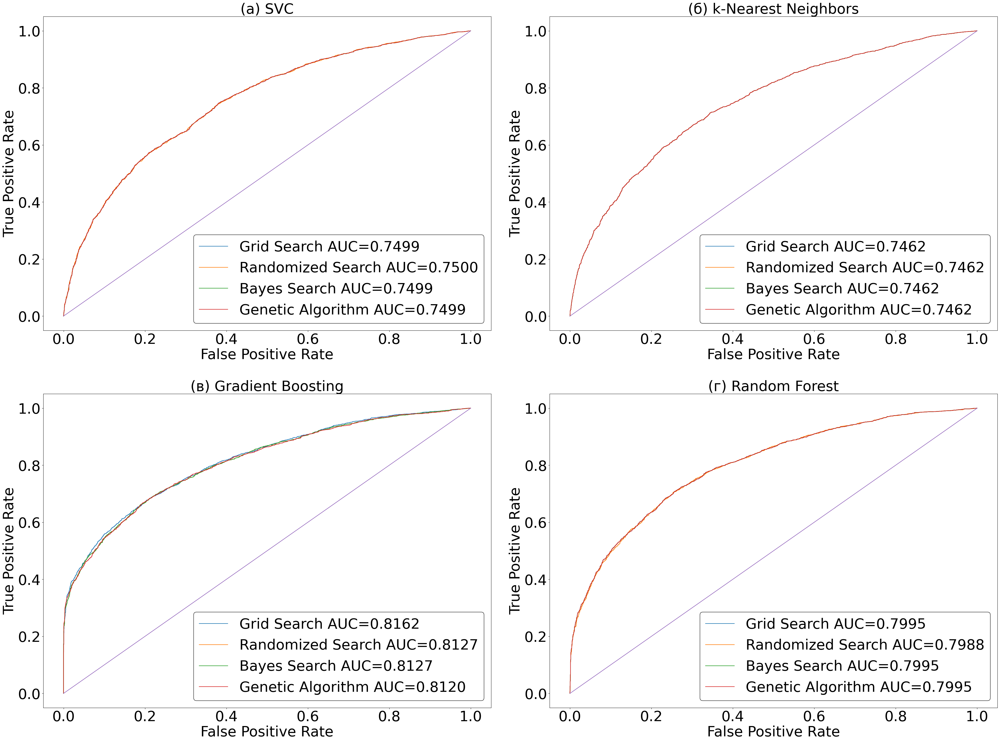

# Сравнение моделей для решения задачи принятия решения на примере классификации кредитного скоринга

Цель работы состоит в том, чтобы сравнить четыре метода подбора гиперпараметров Grid Search, Random Search, Баесовская Оптимизация, Генетический алгоритм и на основе результата исследований использовать лучший из них для данной задачи. В ходе исследования эти модели будут обучаться на одних и тех же данных и сравниваться между собой метриками. Они были выбраны, поскольку на данный момент эти четыре подхода являются одними из самых популярных и не сравнивались друг с другом. В частности, какой алгоритм покажет наилучшие результаты и что будет способствовать этому.

Используемые библиотеки:
- scikit-learn
- boruta
- sklearn-genetic-opt
- pandas
- scikit-optimize

Используемые модели:
- SVM
- K Nearest Neighbors
- Random Forest
- Gradient Boosting

Используемые методы:
- Grid Search
- Randomized Search
- Bayes Search
- Genetic Algorithm

